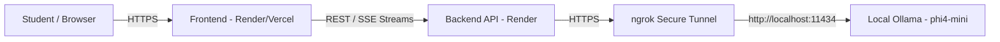

# VidyaLoop Socratic Tutor

VidyaLoop Tutor is an elite Socratic AI tutoring chatbot designed for CBSE students. It guides students through problems without directly giving them the answers, using step-by-step scaffolding and tailored learning styles (Visual, Math, Text, Interactive).

The project consists of a **Python FastAPI** backend, a **React (Vite)** frontend, and is powered by the local `phi4-mini` LLM running via **Ollama**.

---

## 🏗️ System Architecture & Deployment

The current production/staging environment operates across a hybrid cloud-local setup:
- **Frontend**: Deployed as a static site (on Render or Vercel).
- **Backend API**: Deployed as a public Web Service on **Render**.
- **LLM Engine**: Runs locally on a developer machine using **Ollama** (`phi4-mini` model).
- **Tunneling**: Because Ollama runs locally, an **ngrok** HTTPS tunnel connects the public Render backend to the local Ollama instance.



### Critical Deployment Note: ngrok Host Header Check
Recent security updates in Ollama reject requests with unrecognized `Host` headers (returning `403 Forbidden`). To bypass this, the ngrok tunnel **must** be started with a host-header rewrite:
```bash
# A helper script is included in the root directory:
./start_tunnel.sh
```

---

## ⚙️ Environment Variables (Backend Configuration)

When deploying on Render or running locally via `.env`, configure the following variables:

| Variable | Default Value | Description |
| :--- | :--- | :--- |
| `OLLAMA_BASE_URL` | `http://localhost:11434` | The URL where Ollama is reachable. In production, set this to the active ngrok HTTPS forwarding URL (e.g., `https://xxxx.ngrok-free.dev`). |
| `FRONTEND_URL` | `*` | The public URL of the frontend (e.g., `https://vidyaloop-chatbot-1.onrender.com`). Used by CORS middleware. If set to `*`, credentials are automatically disabled to prevent Starlette CORS errors. |
| `OLLAMA_MODEL` | `phi4-mini` | The model name loaded in Ollama. |
| `TEMPERATURE` | `0.7` | LLM generation temperature. |
| `CONTEXT_WINDOW` | `8192` | Maximum context token limit. |

---

## 🚀 Local Development Setup

### 1. Prerequisites
- Python 3.10+
- Node.js (v18+ recommended)
- [Ollama](https://ollama.com/) with `phi4-mini` pulled (`ollama pull phi4-mini`)
- [ngrok](https://ngrok.com/) CLI installed

### 2. Start the Local LLM & Tunnel
Open a terminal and start the tunnel using the provided script:
```bash
./start_tunnel.sh
```
*(Ensure Ollama is running in the background via `ollama serve` or the desktop app).*

### 3. Backend Setup (FastAPI)
In a new terminal, set up the Python virtual environment and start the server:
```bash
python -m venv venv
source venv/bin/activate  # On Windows: venv\Scripts\activate
pip install -r requirements.txt

# Start local dev server on port 8000
uvicorn app.main:app --reload --host 0.0.0.0 --port 8000
```

### 4. Frontend Setup (React)
In a new terminal, navigate to the `frontend` folder:
```bash
cd frontend
npm install
npm run dev
```
Access the app at `http://localhost:5173`.

---

## 🧠 Backend Engineer Guide: AI & Prompt Engineering Architecture

This section contains complete context and architectural plans for incoming backend engineers tasked with upgrading the chatbot's intelligence and feature utilization.

### Current Limitation: Zero-Shot Prompt Overload
Currently, `app/core/prompts.py` uses a standard zero-shot system prompt. While it lists strict Socratic rules and formatting tools (Mermaid diagrams, LaTeX math, JSON flashcards), small models like `phi4-mini` (3.8B parameters) struggle to follow all rules simultaneously. 
- **Symptom**: The model frequently ignores formatting tools or breaks Socratic boundaries by giving away direct answers after a single prompt.
- **Root Cause**: Small models lack the internal capacity to evaluate complex conditional rules without scratchpad reasoning or concrete examples.

### Required Upgrades (Roadmap)

To resolve these limitations, the backend engineer must implement a **Chain-of-Thought (CoT) + Few-Shot** architecture inside `app/core/prompts.py` and `app/services/llm.py`.

#### Upgrade 1: Enforce `<think>` Blocks (Chain-of-Thought)
We must force the model to plan its pedagogical strategy *before* generating the user-facing response.
- **Implementation**: In the system prompt, explicitly instruct the model: *"You MUST begin every response with a `<think>` block."*
- **Reasoning Process**: Inside `<think>...</think>`, the model must answer:
  1. What concept is the student struggling with?
  2. Have I asked a diagnostic question yet?
  3. Does their learner profile (`visual`, `math`, etc.) require a tool like a Mermaid diagram or LaTeX equation right now?
  4. Am I about to give away the answer? (If yes, rephrase into a probing question).
- **Frontend Integration**: Good news — `app/services/parser.py` (and tested in `tests/test_parser.py`) is already built to parse and strip `<think>` blocks so the student only sees the clean final answer while the AI benefits from enhanced reasoning!

#### Upgrade 2: Restructure Prompt with XML Tags
Rewrite `build_system_prompt(session)` in `app/core/prompts.py` using structured XML tags instead of markdown lists. Small models parse XML hierarchies significantly better:
```xml
<identity>
  You are VidyaLoop Tutor, an elite Socratic AI teaching assistant for CBSE Class {session.class_level}.
</identity>
<methodology>
  <step>1. Diagnose existing knowledge with ONE probing question.</step>
  <step>2. Guide step-by-step. Never leak answers.</step>
</methodology>
<tools>
  <tool name="mermaid">Use ```mermaid blocks for visual flowcharts and concepts.</tool>
  <tool name="latex">Use $$math$$ for equations.</tool>
</tools>
<protocol>
  Always plan inside <think> tags before speaking.
</protocol>
```

#### Upgrade 3: Dynamic Few-Shot Example Injection
Instead of relying purely on instructions, inject **1 to 2 tailored conversation examples** into the prompt based on `session.learner_type`.
- **How it works**: Create a helper function `get_few_shot_examples(learner_type: str) -> str` that returns pre-written ideal exchanges.
- **Visual Learner Example**: If `session.learner_type == 'visual'`, inject a simulated exchange where the assistant writes a `<think>` block deciding that a process needs visualization, followed by a valid ````mermaid graph TD; A-->B; ```` block.
- **Math Learner Example**: If `session.learner_type == 'math'`, inject an example demonstrating step-by-step formula derivation using LaTeX `$$...$$` syntax without revealing the final numerical solution.

By combining XML structure, CoT reasoning (`<think>`), and dynamic Few-Shot examples, `phi4-mini` will reliably utilize all frontend interactive blocks and maintain strict Socratic discipline.

---

## 📡 API Endpoints Reference

- **`GET /`** : Health check endpoint.
- **`GET /sessions`** : Retrieves metadata for all past sessions (used by Sidebar).
- **`GET /session/{session_id}/history`** : Retrieves full conversation history for a specific session.
- **`POST /chat/stream`** : Core streaming endpoint. Takes `session_id`, `message`, `student_name`, `class_level`, and `learner_type`. Yields SSE token streams from Ollama.
- **`DELETE /session/{session_id}`** : Deletes a session and its associated chat history.
