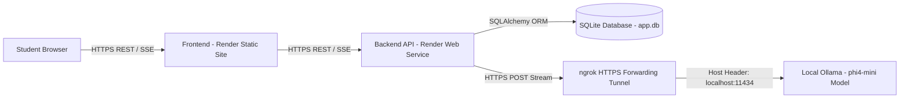

# VidyaLoop Socratic Tutor — Comprehensive Engineering & Developer Guide

VidyaLoop Tutor is an elite Socratic AI tutoring chatbot designed for CBSE students. It guides students through complex concepts without directly giving away numerical answers or final solutions, utilizing step-by-step pedagogical scaffolding and dynamic learning profiles (Visual, Math, Text, Interactive).

This document serves as the **complete, exhaustive onboarding manual** for incoming backend and full-stack engineers. It details the system architecture, step-by-step cloning and setup procedures, development rules, architectural change history, and the future AI prompt engineering roadmap.

---

## 📑 Table of Contents
1. [System Architecture & Deployment Topology](#1-system-architecture--deployment-topology)
2. [Directory Structure & Module Overview](#2-directory-structure--module-overview)
3. [Complete Step-by-Step Setup Guide (Post-Cloning)](#3-complete-step-by-step-setup-guide-post-cloning)
4. [Environment Variables Reference](#4-environment-variables-reference)
5. [Development Rules & Engineering Guidelines](#5-development-rules--engineering-guidelines)
6. [Architectural Change History & Commit Log](#6-architectural-change-history--commit-log)
7. [AI & Prompt Engineering Roadmap (Next Steps for Backend)](#7-ai--prompt-engineering-roadmap-next-steps-for-backend)
8. [API Endpoints Reference](#8-api-endpoints-reference)

---

## 1. System Architecture & Deployment Topology

The system operates across a hybrid cloud-local topology:
- **Frontend**: A React (Vite + TailwindCSS) single-page application deployed as a Static Site Web Service on **Render** (or Vercel).
- **Backend API**: An asynchronous Python **FastAPI** REST and Server-Sent Events (SSE) server deployed as a public Web Service on **Render**.
- **Database**: Stateless server architecture backed by a persistent **SQLite** database (`app.db`) managed via SQLAlchemy ORM for session and message history storage.
- **LLM Engine**: Runs locally on a dedicated GPU/CPU developer machine using **Ollama** serving the `phi4-mini` (3.8B parameter) model.
- **Secure Tunneling**: Because Ollama runs locally behind a NAT/firewall, an **ngrok HTTPS secure tunnel** bridges the public Render backend to the local Ollama instance (`http://localhost:11434`).



### ⚠️ Critical Security Note: Ollama Host Header Enforcement
Since Ollama v0.1.30, strict security middleware rejects incoming HTTP requests containing unrecognized `Host` headers (e.g., `https://xxxx.ngrok-free.dev`), returning an empty `403 Forbidden` response. This previously caused silent blank messages on the frontend. 
**Resolution**: The ngrok tunnel must **always** be initialized with the host-header rewrite flag. A dedicated helper script (`start_tunnel.sh`) is provided in the project root to enforce this automatically.

---

## 2. Directory Structure & Module Overview

```text
vidyaloop-chatbot/
├── app/
│   ├── core/
│   │   ├── config.py         # Central environment configuration (Pydantic settings)
│   │   └── prompts.py        # System prompt generation engine for Socratic AI behavior
│   ├── models/
│   │   ├── database.py       # SQLAlchemy declarative base and session engine setup
│   │   ├── storage.py        # Database schema definitions (Session and Message tables)
│   │   └── student.py        # Pydantic data models for student profiling
│   ├── services/
│   │   ├── llm.py            # Async httpx streaming client communicating with Ollama
│   │   └── storage.py        # CRUD repository layer abstracting SQLite database operations
│   ├── database.py           # Database initialization hooks triggered on server startup
│   └── main.py               # FastAPI application entrypoint, CORS setup, and REST routing
├── frontend/
│   ├── src/
│   │   ├── components/       # UI building blocks (ChatWindow, Sidebar, FlashcardBlock, etc.)
│   │   ├── App.jsx           # Main React application controller and API fetch routing
│   │   └── main.jsx          # React DOM entrypoint
│   ├── package.json          # Frontend dependencies and Vite build scripts
│   └── vite.config.js        # Vite bundler configuration
├── tests/
│   ├── test_ollama.py        # Backend verification script for Ollama connectivity
│   └── test_parser.py        # Test suite verifying frontend parsing of <think> and Mermaid blocks
├── requirements.txt          # Python backend package dependencies
├── start_tunnel.sh           # Executable bash script to start ngrok with required host rewrites
└── README.md                 # Project documentation and engineering manual
```

---

## 3. Complete Step-by-Step Setup Guide (Post-Cloning)

Follow these exact instructions to set up the full development environment from scratch after running `git clone`:

### Step 1: Clone the Repository
```bash
git clone https://github.com/superionsai/vidyaloop-chatbot.git
cd vidyaloop-chatbot
```

### Step 2: Install and Start Ollama & Model
1. Install Ollama from [https://ollama.com](https://ollama.com).
2. Open a terminal and pull the required model:
   ```bash
   ollama pull phi4-mini
   ```
3. Ensure Ollama is running (`ollama serve` or via desktop system tray). Verify local connectivity:
   ```bash
   curl http://localhost:11434/api/tags
   ```

### Step 3: Initialize the Secure Tunnel (ngrok)
1. Ensure the [ngrok CLI](https://ngrok.com/download) is installed and authenticated with your authtoken (`ngrok config add-authtoken <TOKEN>`).
2. Execute the included script from the project root:
   ```bash
   chmod +x start_tunnel.sh
   ./start_tunnel.sh
   ```
3. Note the Forwarding HTTPS URL shown in the terminal output (e.g., `https://xxxx.ngrok-free.dev`). Keep this terminal window running.

### Step 4: Backend Setup & Virtual Environment
Open a second terminal window in the project root:
```bash
# Create Python virtual environment
python3 -m venv venv

# Activate virtual environment
source venv/bin/activate       # macOS / Linux
# venv\Scripts\activate        # Windows Command Prompt

# Install backend dependencies
pip install --upgrade pip
pip install -r requirements.txt
```

### Step 5: Configure Environment Variables
Create a `.env` file inside the project root directory (alongside `requirements.txt`):
```ini
OLLAMA_BASE_URL=http://localhost:11434
# When testing against ngrok externally, replace the above line with:
# OLLAMA_BASE_URL=https://your-ngrok-url.ngrok-free.dev

FRONTEND_URL=http://localhost:5173
OLLAMA_MODEL=phi4-mini
TEMPERATURE=0.7
CONTEXT_WINDOW=8192
```

### Step 6: Start the Backend Server
While inside the activated virtual environment:
```bash
uvicorn app.main:app --reload --host 0.0.0.0 --port 8000
```
- The server will initialize the SQLite database automatically on startup via `init_db()`.
- Verify backend health by opening `http://localhost:8000/` in your browser. You should see: `{"status": "VidyaLoop Tutor API is running..."}`.

### Step 7: Frontend Setup & Dev Server
Open a third terminal window and navigate to the `frontend` folder:
```bash
cd frontend
npm install
npm run dev
```
- Open `http://localhost:5173` in your browser. You can now create sessions, select learner types, and interact with the AI Tutor in real time!

---

## 4. Environment Variables Reference

Do **not** hardcode URLs or API keys directly in source code files. Use environment variables defined in `.env` locally or set in the Render Dashboard for production:

| Variable Name | Default Value | Description |
| :--- | :--- | :--- |
| `OLLAMA_BASE_URL` | `http://localhost:11434` | Target URL for the Ollama server. In production/staging on Render, set this to the active HTTPS ngrok forwarding URL. |
| `FRONTEND_URL` | `*` | Allowed origin for CORS middleware in `app/main.py`. In production, set this to the exact static site URL (e.g., `https://vidyaloop-chatbot-1.onrender.com`). |
| `OLLAMA_MODEL` | `phi4-mini` | The exact tag of the LLM model to invoke during inference. |
| `TEMPERATURE` | `0.7` | Controls LLM creativity/randomness. Lower values (`0.3`) increase analytical precision; higher values (`0.8`) increase conversational variety. |
| `CONTEXT_WINDOW` | `8192` | Maximum context token window passed to Ollama during chat completion. |

---

## 5. Development Rules & Engineering Guidelines

Every developer working on this codebase must strictly adhere to the following rules:

### Rule 1: Stateless LLM Service Architecture
The LLM Service (`app/services/llm.py`) is entirely **stateless**. Do not store conversation history in memory, global dictionaries, or class instances. 
- **Protocol**: On every incoming request to `/chat/stream`, the service must query the SQLite database via `storage.get_messages(session_id)` to reconstruct the full chat history before appending the user's prompt.

### Rule 2: SSE (Server-Sent Events) Contract Preservation
The frontend real-time streaming relies on strict SSE JSON payloads yielded from `app/services/llm.py`. Never alter or break these message types:
- **Token Chunk**: `data: {"type": "token", "text": "..."}\n\n`
- **Stream Completion**: `data: {"type": "done"}\n\n`
- **Error State**: `data: {"error": "Error message details..."}\n\n`

### Rule 3: CORS & Starlette Security Middleware
When configuring `CORSMiddleware` in `app/main.py`, remember the Starlette security rule: **If `allow_origins=["*"]` is set, `allow_credentials` MUST be set to `False`**, otherwise browser engines will reject cross-origin requests. The current codebase dynamically evaluates this via `cors_origin != "*"`. Do not revert this to hardcoded values.

### Rule 4: Mandatory Local Verification Before Committing
Before pushing any changes to GitHub, run the local verification tests to ensure parser and model integrity:
```bash
# Verify frontend markdown and <think> tag parser logic
python -m unittest tests/test_parser.py

# Verify backend connectivity and streaming response parsing
python -m unittest tests/test_ollama.py
```

---

## 6. Architectural Change History & Commit Log

This section documents recent critical architectural bug fixes and structural migrations so backend engineers understand the "why" behind the code:

### Commit `b18cf5e`: Add start_tunnel.sh and comprehensive architectural guide
- **Context**: Added `start_tunnel.sh` to version control to standardize local tunnel initialization.

### Commit `git commit -m "Fix CORS issue"`: Dynamic CORS Origin Handling & Credentials Fix
- **Problem**: Deploying the backend to Render while accessing it from Vercel/Render frontend resulted in silent CORS blocking in browser consoles (`net::ERR_FAILED`).
- **Root Cause**: `app/main.py` hardcoded `allow_origins=["*"]` while simultaneously setting `allow_credentials=True`. Starlette/FastAPI CORS specs prohibit wildcard origins when credentials are enabled.
- **Resolution**: Updated `app/main.py` to read `FRONTEND_URL` from environment variables. Set `allow_credentials=(cors_origin != "*")`, ensuring automated compatibility for both wildcard local testing and strict production domain binding.

### Architectural Resolution: ngrok & Ollama HTTP 403 Host Header Bypass
- **Problem**: When requests streamed from Render to the ngrok URL, Ollama returned an empty `HTTP/2 403 Forbidden` response (`content-length: 0`), causing chat streams to close immediately without yielding tokens.
- **Root Cause**: Ollama v0.1.30 introduced anti-DNS-rebinding security checks that inspect the incoming `Host` header. Requests bearing ngrok domains (`*.ngrok-free.dev`) were rejected.
- **Resolution**: Created `start_tunnel.sh` executing `ngrok http 11434 --host-header="localhost:11434"`. This forces ngrok to rewrite the incoming HTTP Host header to `localhost:11434` before delivering the payload to Ollama, bypassing the security rejection completely. Additionally, ensured `app/services/llm.py` passes `"ngrok-skip-browser-warning": "true"` in HTTP headers.

### Infrastructure Migration: Transition from Vercel to Unified Render Deployment
- **Problem**: Vercel deployment limits and organization team restrictions caused friction during CI/CD workflows.
- **Resolution**: Migrated frontend hosting to Render Static Sites (`vidyaloop-chatbot-1.onrender.com`). Both frontend and backend are now managed cohesively within a single Render workspace.

---

## 7. AI & Prompt Engineering Roadmap (Next Steps for Backend)

This is the primary directive for the next backend engineer. The infrastructure is now 100% stable; all effort must focus on upgrading the reasoning and formatting capabilities of the AI Tutor.

### Current Problem: Zero-Shot System Prompt Overload
In `app/core/prompts.py`, the `build_system_prompt()` function supplies a standard 15-rule zero-shot prompt. Small models like `phi4-mini` (3.8B parameters) experience **instruction fatigue** when fed complex, competing directives (e.g., "be Socratic", "never give answers", "use Mermaid", "output LaTeX formulas"). As a result, the model frequently ignores formatting tools or leaks direct numerical answers after a single student prompt.

### Action Plan: Implement Chain-of-Thought (CoT) + Dynamic Few-Shot Architecture

#### Step 1: Enforce Chain-of-Thought via `<think>` Blocks
To prevent the model from impulsively blurting out answers, force it to generate a hidden scratchpad reasoning block before emitting user-facing text.
- **Action**: Modify `app/core/prompts.py` to command: *"You MUST begin every single response by writing your internal pedagogical plan inside `<think>...</think>` tags."*
- **Internal Plan Requirements**: Inside `<think>`, the model must explicitly answer:
  1. What is the student's exact learning profile (`visual`, `math`, `text`, `interactive`)?
  2. Have I diagnosed their baseline knowledge yet?
  3. Does this explanation require a visual flowchart (Mermaid) or mathematical formula (LaTeX)?
  4. Am I about to give away the direct answer? (If yes, rewrite as a probing hint).
- **Frontend Compatibility**: The frontend parser (`tests/test_parser.py`) already strips `<think>...</think>` tags from the chat bubble! The student will see only clean, beautifully formatted pedagogical output while the AI benefits from structured reasoning.

#### Step 2: Refactor Prompt into Structured XML Tags
Replace standard markdown bullet points in `app/core/prompts.py` with strict XML hierarchies. Small models parse semantic XML boundaries significantly better:
```python
def build_system_prompt(session: Session) -> str:
    return f"""<system_instructions>
  <identity>
    You are VidyaLoop Tutor, an elite Socratic AI teaching assistant for CBSE Class {session.class_level}.
    Student Name: {session.student_name}
    Learner Profile: {session.learner_type.upper()}
  </identity>
  
  <socratic_methodology>
    <rule>1. Diagnose first: Ask ONE probing question before explaining.</rule>
    <rule>2. Scaffolding: Guide step-by-step. Never leak final numerical answers.</rule>
    <rule>3. Frustration Prevention: If student struggles for 3 turns, provide a clear explanation and check understanding.</rule>
  </socratic_methodology>
  
  <rendering_tools>
    <tool name="latex">Wrap equations in double dollar signs: $$E = mc^2$$</tool>
    <tool name="mermaid">For visual learners or process flows, you MUST output valid markdown code blocks with language `mermaid`.</tool>
  </rendering_tools>
  
  <protocol>
    You MUST plan your pedagogical approach inside <think>...</think> tags before speaking directly to {session.student_name}.
  </protocol>
</system_instructions>"""
```

#### Step 3: Implement Dynamic Few-Shot Example Injection
Zero-shot instructions tell a model *what* to do; few-shot examples show it *how* to do it.
- **Action**: Create a helper function `get_few_shot_examples(learner_type: str) -> list[dict]` in `app/core/prompts.py` that injects 1-2 pre-written ideal message exchanges into the `ollama_messages` array in `app/services/llm.py` right after the system prompt.
- **Example for `'visual'` Learner**: Inject an assistant message where the model writes a `<think>` block deciding that a physics concept requires a diagram, followed immediately by a valid ````mermaid graph TD; A[Force]-->B[Acceleration]; ```` block and a probing Socratic question.
- **Example for `'math'` Learner**: Inject an assistant message demonstrating algebraic step-by-step scaffolding using `$$LaTeX$$` equations without revealing the final numerical result.

By implementing this three-part architecture (CoT `<think>`, XML formatting, and Dynamic Few-Shot injection), `phi4-mini` will achieve state-of-the-art tutoring reliability and fully utilize all interactive UI rendering blocks.

---

## 8. API Endpoints Reference

| Method | Endpoint | Description |
| :--- | :--- | :--- |
| `GET` | `/` | Health check endpoint returning API operational status. |
| `GET` | `/sessions` | Returns a list of all active/past chat sessions with metadata (used to populate the frontend Sidebar). |
| `GET` | `/session/{session_id}/history` | Retrieves the full chronological message history for a specific session ID from SQLite. |
| `POST` | `/chat/stream` | Core streaming endpoint. Accepts `ChatRequest` JSON (`session_id`, `message`, `student_name`, `class_level`, `learner_type`). Returns Server-Sent Events (`text/event-stream`). |
| `DELETE` | `/session/{session_id}` | Hard deletes a session and all its associated messages from the SQLite database. |
